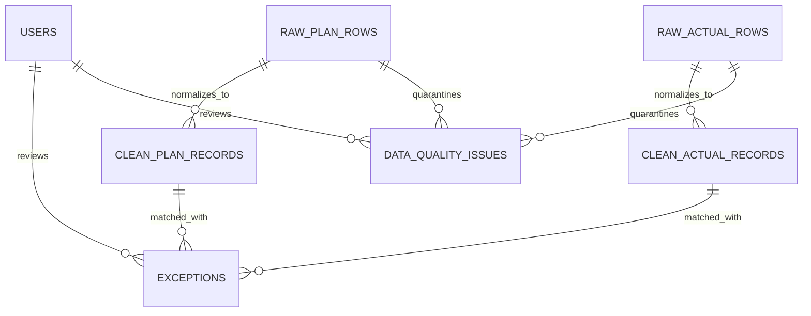

# Architecture — Mini Exception Inbox

This app is a small MERN stack system for reviewing production mismatches. The backend owns ingestion, cleaning, matching, and auth. The frontend just consumes the API and keeps the review flow simple.

## System overview

The data flow is:

1. CSV files are read from `candidate_pack/data`.
2. Raw rows are stored exactly as they arrive.
3. Clean rows are built from the raw rows after date and number normalization.
4. Exceptions are generated only from matched clean plan and actual rows.
5. Data-quality issues are stored separately so they do not pollute the exception math.
6. The React dashboard reads the API and lets the reviewer filter, inspect, and update status.

## Architecture diagram


## Table design

The database is split into a few small collections:

- `users` stores the seeded admin login.
- `raw_plan_rows` stores every imported plan row with the original CSV payload.
- `raw_actual_rows` stores every imported actual row with the original CSV payload.
- `clean_plan_records` stores normalized plan rows that are safe to match.
- `clean_actual_records` stores normalized actual rows that are safe to match.
- `exceptions` stores matched pairs that fall below the threshold.
- `data_quality_issues` stores duplicates, blanks, invalid dates, and unmatched rows.

## Relationships



The important bit is that only the clean tables participate in exception generation. The raw tables stay available for traceability, and the data-quality table keeps bad rows visible without mixing them into the business result.

## Tech stack

| Layer | Stack | Why |
|---|---|---|
| Database | MongoDB Atlas + Mongoose | Fits the CSV-first shape and keeps raw and clean records close together |
| Backend | Node.js + Express | Small surface area, easy auth and API handling |
| Frontend | React + Vite | Fits a dashboard workflow and works well with the backend |
| Data fetching | TanStack Query | Makes filters, caching, and status updates easier |
| UI | Tailwind + shadcn | Fast to build, easy to keep minimal and consistent |

## Key decisions

- I used MongoDB instead of a relational SQL database because the source data is semi-structured and the assignment benefits from keeping raw payloads next to cleaned records. It also matches the company stack.
- I used React on the frontend because it integrates cleanly with a Node backend and is a natural fit for a dashboard with filters and side panels.
- I kept the API narrow so the UI could stay focused on review and status updates instead of branching into unnecessary screens.
- I used a status flow that supports `open`, `acknowledged`, and `resolved`, so “unresolve” is just switching a record back to `open`.

## CSV facts I verified

The source files are not fully clean, and the architecture reflects that.

- `production_plan.csv` has 1,085 rows.
- `actual_production.csv` has 1,080 rows.
- The plan file uses both ISO dates and slash-form dates.
- There are blank `planned_units` rows in the plan file.
- There are duplicate normalized plan groups.
- There are unmatched rows on both sides.

## Running the project

```bash
cp backend/.env.example backend/.env
cp frontend/.env.example frontend/.env
cd backend && npm install
cd ../frontend && npm install
cd ..
./run.sh
```

